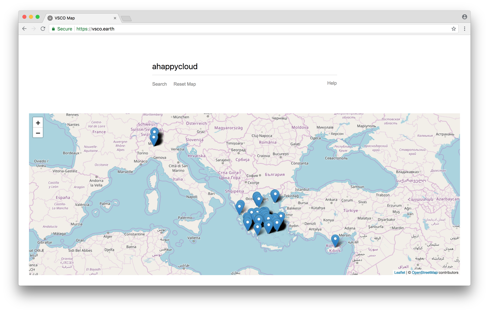

# vsco-map

:world_map: stalking gone webscale



## Building/Running

Assuming you have `ruby`, `bundler`, `node`, and `yarn` installed run the following:

```sh
yarn && bundle
yarn start
```

## What is this? :thinking:
Enter a VSCO username, and this site will map that user's images.

## Where is the data coming from? :bar_chart:
VSCO stores location coordinates in their backend, I'm guessing they get it from EXIF data.

## This is kind of creepy. :scream:
Agreed.

## Why is the backend in ruby? :gem:
Most of the backend code is taken from my other project [vsco-dl](https://github.com/HuggableSquare/vsco-dl).
